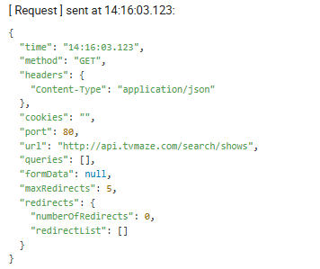
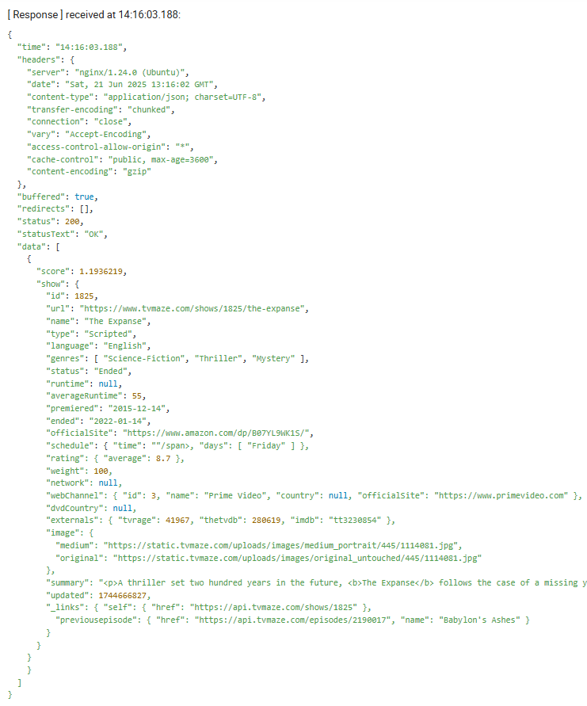

# mocha-api-tests
This repo demonstrates how APIs can be tested on a Mocha test framework. The tests are not examples of how to test an API. The tests only demonstrate the GET and POST methods. The PUT method functionality is basically the same as the POST method functionality. 

The package being used to test APIs is [Superagent](https://www.npmjs.com/package/superagent).
The POST tests utilises a mocked reponse using [Nock](https://www.npmjs.com/package/nock).

# The API helper
The helper allows you to test the following methods:
- Get
- Post
- Put
- Delete

The return of these functions contains an object with selected Request and Response information.

Request:




Response:




## Install
Add mocha-api-tests to your project by adding it to to your package.json:
```
  "dependencies": {
    "mocha-api-tests": "github:CDTester/mocha-api-tests"
  },
```
Then install it with:
```
npm i
```


## Usage
Usage examples can be found on github [mocha-summary-report](https://github.com/CDTester/mocha-summary-report).

In these expamples, the API details are stored in an environment config JSON file. These configs contain details like:
- baseUrl
- authType (e.g. basic, bearer, x-api-key etc)
- auth (the auth key)
- headers (default heading is already applied for "Content-Type": "application/json" )
- cookies
- redirect (default number of redirects is set to 5, can set to 0 so that no redirects occur)


Import the apiHelper
```
import apiHelper from 'mocha-api-tests';
```

Initiate the class using:
```
const api:apiHelper = new apiHelper({api.configs});
```

Then call the API using either:
- getRequest
- postRequest
- putRequest
- deleteRequest

The request requires an endpoint to the URL, then optionaly query / body / file
```
const query = { key: 'value' };
const body = { key1: "value", key2: "value" };
const file = ["folderFromRoot", "file.type"]
const test = await api.postRequest('bodyandquery', query, body, filePath);
```
